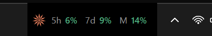

<!-- Selector de idioma -->
[English](README.md) · **Español**

# Claude Code Meter

Un medidor del **consumo de tokens de [Claude Code](https://claude.com/claude-code)** para Windows.
Lee los registros locales de sesiones de Claude Code y muestra cuánto llevas
gastado **hoy / esta semana / este mes**, comparado con un objetivo que pones tú.



> Las cifras (`D`ía · `S`emana · `M`es) viven dentro de la barra de tareas, junto al
> reloj. Cada porcentaje se colorea según su nivel: 🟢 < 70 % · 🟡 < 90 % · 🔴 ≥ 90 %.
> En Windows en inglés las etiquetas se muestran como `D` · `W` · `M`.

Incluye **tres presentaciones del mismo medidor**. Eliges **una** (no se ejecutan
a la vez: muestran los mismos datos de tres formas distintas):

| Estilo   | Qué es | Aspecto |
|----------|--------|---------|
| **barra** (`bar.py`)  | Cifras **dentro de la barra de tareas**, junto al reloj | `✳ D 77% · S 62% · M 63%` |
| **tray** (`tray.py`)  | **Icono en la bandeja del sistema** con el dato dibujado y el detalle en el tooltip | `63%` |
| **panel** (`meter.py`) | **Panel flotante** en la esquina, con barras de progreso | recuadro con HOY/SEM/MES |

`D` = hoy · `S` = semana · `M` = mes, cada uno en **% de su objetivo**.
Los colores cambian solos: 🟢 < 70 % · 🟡 < 90 % · 🔴 ≥ 90 %.

---

## ⚠️ Qué mide (y qué no)

- ✅ Solo el consumo de **Claude Code ejecutándose en este ordenador**, leyendo
  `~/.claude/projects/**/*.jsonl`.
- ❌ **No** mide Claude en la web/app, ni la API, ni otros ordenadores.
- ❌ **No** es el límite real de tu suscripción: ese dato lo controla el servidor
  de Anthropic y no se guarda en local (solo se ve con `/usage` dentro de Claude Code).

Por eso "lo que queda" se calcula contra un **objetivo personal** que defines tú,
no contra el límite del plan.

Por defecto **no cuenta la relectura de caché** (`cache_read`), que dispararía las
cifras x100 al reenviar el contexto. Mide el trabajo real: `input + output + cache_write`.

---

## Requisitos

- Windows 10/11
- Python 3.9+ (con `tkinter`, incluido en el instalador oficial de Python)
- Dependencias: `pip install -r requirements.txt`
  - `bar.py` necesita **Pillow** (dibuja el logo).
  - `tray.py` necesita **Pillow** y **pystray**.
  - `meter.py` no necesita nada externo.

## Uso

Un único punto de entrada, `main.py`, lanza el estilo que elijas. **No hay que
ejecutar varios archivos**: escoge uno.

```bash
python main.py         # barra de tareas (por defecto, recomendado)
python main.py tray    # icono en la bandeja del sistema
python main.py panel   # panel flotante en la esquina
```

(También puedes lanzar cada estilo directamente con `python bar.py`, `python tray.py`
o `python meter.py`, pero `main.py` es la forma recomendada.)

### Ajustar los objetivos

Clic derecho sobre las cifras → **Ajustar objetivo** (abre `config.json`), o crea
tu `config.json` a partir de `config.example.json`:

```json
{
  "daily_budget": null,          // objetivo diario; null = semanal / 7
  "weekly_budget": 10000000,     // tokens/semana
  "monthly_budget": 60000000,    // tokens/mes
  "count_cache_read": false,     // true = incluir relectura de caché
  "refresh_sec": 60
}
```

### Arranque automático (Windows)

`Iniciar Meter.vbs` lanza el medidor (estilo barra) sin ventana de consola. Para
que arranque al encender, crea un acceso directo a ese `.vbs` en la carpeta de
Inicio (`Win+R` → `shell:startup`).

## Cómo funciona la versión de barra

Windows 11 repinta la barra de tareas por encima de las ventanas insertadas con
`SetParent`, así que `bar.py` usa una ventana **topmost** colocada por coordenadas
de pantalla justo a la izquierda del reloj (`TrayNotifyWnd`) y re-elevada cada
0,7 s. Misma idea que TrafficMonitor / XMeters.

## Licencia

MIT — ver [`LICENSE`](LICENSE).
